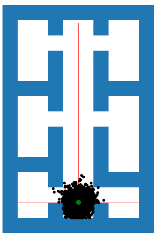
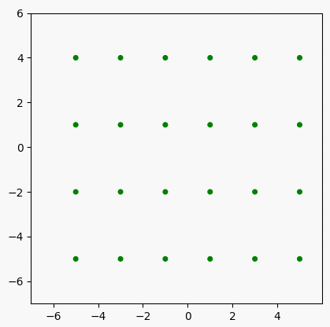
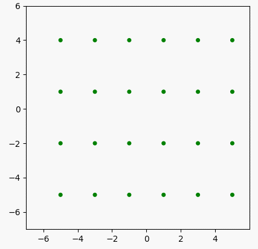
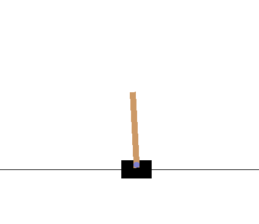
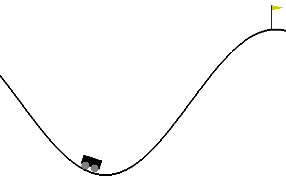
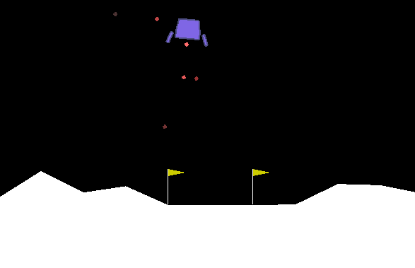

# Shawn_Portfolio

## 1. Robot Localization:
### 1.1 Extended Kalman Filter (EKF)
- Developed a vacuum cleaning robot and estimate its position and orientation in a room in order to be more efficient and precise at vacuuming
- Implemented an EKF to estimate the robot's trajectory based upon the control (forward distance and change in orientation) and measurement data from a sensor placed on the floor of the room that the robot is vacuuming
- Visualized the robot's estimated (#red) and ground-truth (#green) trajectories

 

### 1.2 EKF + Particle Filter
- Improved the EKF to better estimate the pose of the vacuum cleaner by replacing the seneor placed on the ceiling with a LIDAR sensor that records the range and bearing as the robot navigates
- Implemented a standard particle filter that samples from the motion model, reweights the particles according to the observation likelihood, and resamples new particles according to their weights
- Tested the robot in three different environments (simple world, loops world, and rooms world) and showed that the model performs well without knowing the robot's initial pose

Fig. - EKF Particle Filter

### 1.3 EKF + Simultaneously Localization and Mapping (SLAM)
- Implemented the SLAM algorithm that constructs and updates a map of an unknown environment while simultaneously keeping track of the robot's location within it
- Added landmarks to the map and used the sensor (a LIDAR with maximum range of 4 m and an angular field-of-view of 180 degrees) to update the trajectories of the robot and the locations of the landmarks
- Visualized the position of the robot and map estimates along with uncertainty ellipses

Fig.1 - EKF SLAM Small Noise

Fig.2 - EKF SLAM Large Noise

 

 <figcaption>Fig.1 - EKF SLAM Small Noise</figcaption><figcaption>Fig.2 - EKF SLAM Large Noise</figcaption>

## 2. Reinforcement Learning
### 2.1 Policy and Value Iteration for Gridworld
- Implemented the SARSA and Q-Learning with decayed epsilon-greedy policy to solve the grid world game
- Ensured that the agent performed properly and could reach the goal state when starting from different positions and in different scenaires (e.g. with diagonal moves when there is a crosswind upward through the middle of the grid)

 

 

### 2.2 DQN for CartPole and MountainCar
- Implemented a Deep-Q-Network (DQN) for the CartPole and for the MountainCar OpenAI Gym environments
- Optimized for the hyper-parameters to get higher scores and shorter training times

 

 

### 2.3 Policy Gradient for LunarLander
- Trained an agent to correctly land on the landing pad with Policy Gradient algorithm
- Showed that the agent started to learn how to fly after several hundred episodes and and land in the landing pad eventually

 

 

### 2.4 Applying Reinforcement Learning for Stock Trading
- Created a trading environment, based on OpenAI Gym framework, that simulates live stock markets with real market data and developed an agent using five deep reinforcement learning frameworks (A2C, DDPG, PPO, TD3, and SAC) via FinRL that automatically trades stocks
- The training process involves observing stock price change, taking an action and reward's calculation to have the agent adjusting its strategy accordingly
- By interacting with the environment, the trading agent derives a trading strategy with the maximized rewards as time proceeds

## 3. Applying Tree Based Algorithms for Stock Trading
- Used the tree based algorithms (decision tree, bagging tree, random forest, gradient boosting, etc.) to construct algorithmic trading strategies that outperforms the benchmark
- Developed a feature importance technique that dynamically selects an optimal set of features every quarter to optimize the profit of the strategy
- Applied the optuna to automatically optimize the hyperparameters of the model to achieve better performance 

## 4. [Principal Component Analysis (PCA) via Matrix Decomposition](https://github.com/longxiangdai/Shawn-Portfolio/blob/main/PCA%20via%20Matrix%20Decomposition/Principal%20Component%20Analysis%20(PCA)%20via%20Matrix%20Decomposition.ipynb)
- Analyzed the demographic features of different countries and showed that the Principal Component Analysis can be useful for dimensionality reduction and outlier detection
- Provided the mathematical background of Principal Component Analysis and proved that it can be obtained via Singular Value Decomposition of the centered data matrix

## 5. Deep Learning - Education Framework
- Implemented the educational framework (EDF), a deep learning framework, using Python-NumPy
- Constructed the computation graph of a multi-layer perceptron (MLP) with one hidden layer
- Explored how the learning rate and number of layers affect the performance of the neural network
